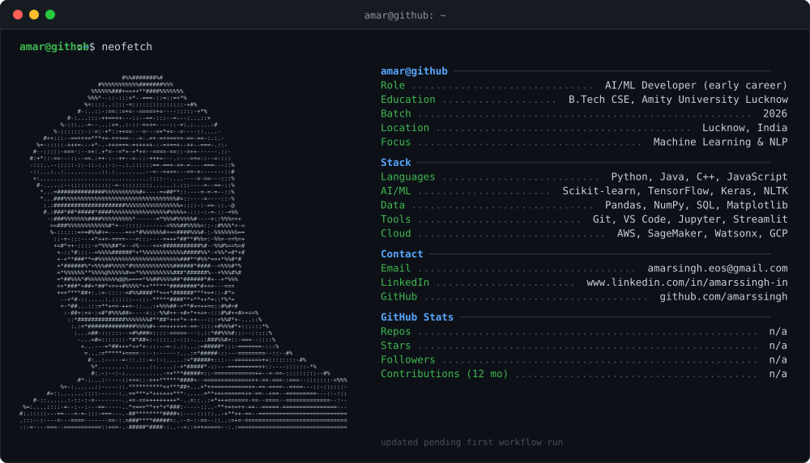
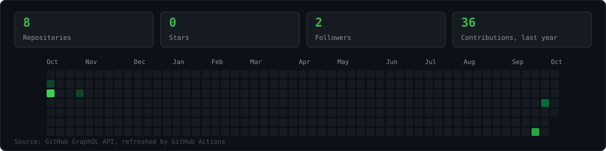

# Amar Singh

**Computer Science graduate · aspiring AI & ML engineer**

[LinkedIn](https://www.linkedin.com/in/amarssingh-in) · [Email](mailto:amarsingh.eos@gmail.com) · [GitHub](https://github.com/amarssingh)

  

## About

I recently graduated with a B.Tech in Computer Science & Engineering and I'm building my career in machine learning and AI. I like taking a problem from raw data to a working application: cleaning and exploring the data, engineering features, comparing models, and packaging the result so someone can actually use it. Right now I'm focused on NLP and applied machine learning in Python.

## Technical Skills

| Area | Tools |
| :-- | :-- |
| **Programming** | `Python` `Java` `C` `C++` `JavaScript` |
| **Machine Learning / AI** | `Scikit-learn` `TensorFlow` `Keras` `NLP` `NLTK` `TF-IDF` `SMOTE` `Model evaluation` `Feature engineering` |
| **Data** | `Pandas` `NumPy` `Matplotlib` `Seaborn` `SQL` `MySQL` `SQLite` |
| **Tools & Platforms** | `Git` `GitHub` `GitHub Actions` `VS Code` `Jupyter Notebook` `Streamlit` |
| **Cloud & AI Platforms** | `AWS` `Amazon SageMaker` `IBM Watson Studio / Watsonx` `Google Cloud` |
| **Web & APIs** | `Django` `REST / API concepts` |

## Featured Projects

<table>
<tr><td valign="top" width="50%"><b>Smart Crop Recommendation System</b> Recommends suitable crops from nitrogen, phosphorus, potassium, temperature, humidity, rainfall and soil pH. Python · Pandas · Scikit-learn · Random Forest · Streamlit</td><td valign="top" width="50%"><b>Sentiment Analysis</b> NLP sentiment classification using TF-IDF features and classical machine-learning models. Python · NLP · NLTK · TF-IDF · Scikit-learn</td></tr>
<tr><td valign="top" width="50%"><b>Client Behavior Prediction Using AI in Banking</b> Classification on the UCI Bank Marketing dataset to predict customer behavior, comparing several models and an ensemble. Logistic Regression · QDA · Gaussian NB · Random Forest · AdaBoost · Voting Classifier</td><td valign="top" width="50%"><b>Flipkart Customer Service Satisfaction Prediction</b> Predicts customer satisfaction from textual and structured customer-service data. Pandas · TF-IDF · SMOTE · Logistic Regression · GridSearchCV</td></tr>
</table>

## GitHub Activity

  

## Experience & Learning

- **Machine Learning Intern, Labmentix**: Python and Pandas, data cleaning and quality checks, exploratory data analysis, feature engineering, visualization, and Scikit-learn models.
- AI Fundamentals: IBM SkillsBuild
- Python Essentials 1: Cisco
- Google Cloud Computing Foundations
- Machine Learning Workshop: IIT Bombay / AWS

## Contact

- Email: [amarsingh.eos@gmail.com](mailto:amarsingh.eos@gmail.com)
- LinkedIn: [www.linkedin.com/in/amarssingh-in](https://www.linkedin.com/in/amarssingh-in)
- Location: Lucknow, India
